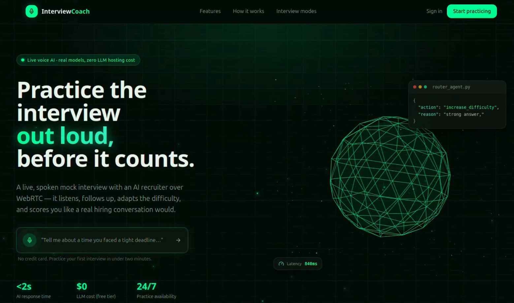

# AI Interview Coach

A web app that runs **real-time spoken job interviews**. A candidate joins a
browser-based WebRTC room, an AI interviewer speaks the questions out loud,
listens to the answers, adapts follow-ups live, and produces a scored feedback
report afterwards.

Every AI call in this system is a real call to a real model — speech-to-text,
text-to-speech and sentiment run as self-hosted microservices; LLM reasoning
runs on Groq. There is no simulated or canned response path anywhere in the
codebase: when the LLM is unreachable the engine raises a typed error rather
than inventing a question (see [llm_client.py](backend/app/modules/agents/llm_client.py)).

New to the project? Start with **[SETUP_GUIDE.md](SETUP_GUIDE.md)** — it takes
you from a clean clone to a working voice interview.



---

## Table of contents

- [AI Interview Coach](#ai-interview-coach)
  - [Table of contents](#table-of-contents)
  - [What it does](#what-it-does)
  - [Tech stack](#tech-stack)
  - [How a live interview works](#how-a-live-interview-works)
  - [Repository layout](#repository-layout)
  - [Domain model](#domain-model)
  - [API surface](#api-surface)
  - [Authentication](#authentication)
  - [Background jobs](#background-jobs)
  - [Services and ports](#services-and-ports)
  - [Common commands](#common-commands)
  - [Testing](#testing)

---

## What it does

**For the candidate**

1. Creates a **target role** (the job they're preparing for) and fills in
   background fields — experience, skills, projects.
2. Clicks **Analyze**; a background job extracts structured
   *knowledge entries* from those fields using the LLM.
3. Starts a **practice interview** — picks a mode
   (`behavioral` / `technical` / `mixed` / `mock_hr_screening`) and a difficulty
   (`junior` / `mid` / `senior`), then joins a live voice room.
4. Talks to the AI interviewer. Questions are grounded in that candidate's own
   extracted knowledge; follow-ups, difficulty escalation and coaching hints are
   decided per turn.
5. Gets a scored report — per-turn evaluations, strengths, gaps, and a
   downloadable PDF.

**For the admin (AI Studio)**

Admins shape *how* the AI behaves, never what a candidate's content is:

- **Agents** — prompts, rubric weights and routing rules for the five sub-agents,
  with draft → active → archived versioning and clone-before-edit.
- **Flows** — a React Flow visual editor over `InterviewFlow.graph_json`. One
  published default flow per interview mode drives every interview in that mode.
  The JSON is compiled into a real executable LangGraph at runtime, so **new
  interview behaviour is a new flow, not new backend code**.
- **Content** — difficulty scaling rules.
- **Users** — read-only view of any candidate's profile, target roles, extracted
  knowledge and session history.
- **Analytics / Monitoring / Security** — platform KPIs, token usage, live
  session observation, admin management and audit logs.

## Tech stack

| Layer | Technology |
|---|---|
| Frontend | Next.js 15 (App Router), React 18, TypeScript, TailwindCSS, Radix UI primitives, Zustand, TanStack Query v5, react-hook-form + Zod, Axios, Recharts, three.js, `@xyflow/react` (React Flow), `livekit-client` |
| Backend | FastAPI, SQLAlchemy 2.0 (async) + asyncpg, Pydantic v2 + pydantic-settings, Alembic, python-jose (JWT), passlib + bcrypt, structlog, fpdf2 |
| Real-time | LiveKit server (WebRTC SFU), coturn (TURN/STUN), `livekit-agents` voice worker, Redis pub/sub |
| Agent engine | LangGraph `StateGraph`, compiled per turn from the session's published flow |
| LLM | **Groq** — OpenAI-compatible `/chat/completions`, free developer tier |
| Speech | faster-whisper (STT) and Piper (TTS), each a standalone FastAPI microservice |
| Signals | `transformers` emotion classifier (`j-hartmann/emotion-english-distilroberta-base`) for confidence scoring |
| Data | PostgreSQL 16, Redis 7, MinIO (recordings + reports), MailHog (dev SMTP) |
| Jobs | Celery worker + beat on Redis |
| Tooling | Docker Compose, ruff, Biome, pytest, Playwright |

Everything except the LLM is open-source and self-hosted. Groq is the one
external dependency — its OpenAI-compatible API means swapping providers (a paid
Groq model, OpenAI, a local Ollama/vLLM instance) is a change to
`GROQ_BASE_URL` / `GROQ_MODEL`, not a code change.

**There is no vector database and no RAG.** Candidate knowledge is retrieved
with a plain SQL filter over that candidate's own `candidate_knowledge_entries`
rows and injected into the Interviewer agent's prompt.

## How a live interview works

```
 Candidate browser (livekit-client)
         │  WebRTC audio (mic ⇄ speaker)
         ▼
   LiveKit SFU  ◄───────────── signed JWT room tokens issued by
         │                     POST /livekit/sessions/{id}/token/
         │  the worker joins the room as "ai-interviewer"
         ▼
 voice-agent worker  (app/voice_worker/)
   ├─ WhisperServiceSTT ──► stt-service   (faster-whisper)
   ├─ InterviewEngineLLM ─► app.modules.agents.engine
   │                          │
   │                          ├─ Redis      : InterviewState between turns
   │                          ├─ LangGraph  : compiled from the flow's graph_json
   │                          │    ├─ Interviewer / Evaluator / Coach ──► Groq
   │                          │    └─ Router : deterministic rule engine
   │                          ├─ signal-service : sentiment → confidence score
   │                          └─ Postgres   : turns, evaluations, agent logs
   └─ PiperServiceTTS ────► tts-service   (Piper)
         │  synthesized speech back into the room
         ▼
   LiveKit SFU ──► candidate's speaker

 In parallel: every turn is published to Redis pub/sub and fanned out over a
 plain WebSocket (/ws/interview/{session_id}) so the browser renders live
 captions without touching the audio path.
```

Barge-in, voice activity detection and end-of-turn detection are handled by
LiveKit Agents; **every interview decision** — what to ask, how to score, whether
to escalate difficulty, when to coach, when to end — is made by our agents.

A turn graph is compiled fresh per turn because a voice interview is inherently
turn-based: the graph must stop and wait for speech that arrives as a separate
event. Cross-turn memory lives in Redis, threaded through by
[engine.py](backend/app/modules/agents/engine.py).

## Repository layout

```
ai-interview-coach-003/
├── backend/
│   ├── app/
│   │   ├── main.py                  FastAPI factory; every router registered here
│   │   ├── core/                    settings, logging, redis, celery_app
│   │   ├── db/                      SQLAlchemy models + session
│   │   ├── modules/
│   │   │   ├── agents/              LangGraph engine, flow compiler, 5 sub-agents,
│   │   │   │                        knowledge extraction, Groq client
│   │   │   ├── auth/                register/login/refresh, JWT cookies, guards
│   │   │   ├── users/               candidate profile
│   │   │   ├── target_roles/        candidate-owned roles + knowledge extraction
│   │   │   ├── interviews/          session lifecycle, transcript, report, ratings
│   │   │   ├── livekit/             room tokens + LiveKit webhooks
│   │   │   ├── ws/                  /ws/interview + /ws/admin/monitoring
│   │   │   ├── speech/              STT/TTS HTTP clients
│   │   │   ├── signals/             sentiment analyzer client
│   │   │   ├── storage/             MinIO object store
│   │   │   ├── notifications/       email templates + Celery mail tasks
│   │   │   ├── metrics/             KPI helpers
│   │   │   ├── catalog/             enums/reference data for the UI
│   │   │   └── admin/               AI Studio: agents, flows, content, users,
│   │   │                            analytics, monitoring, security
│   │   └── voice_worker/            LiveKit Agents worker + STT/LLM/TTS plugins
│   ├── alembic/versions/            3 migrations
│   ├── tests/                       pytest (flow compiler/validation, sweeps, webhooks)
│   └── seed.py                      admin, demo candidate, target role, agents, flow
├── frontend/
│   ├── app/                         App Router: /login, /register, /candidate/*, /admin/*
│   ├── components/                  ui primitives, interview UI, flow builder, marketing
│   ├── hooks/                       use-livekit-room, use-interview-events, use-api, ...
│   ├── lib/ store/ types/           API client, Zustand stores, shared types
│   ├── middleware.ts                edge route guard + silent token refresh
│   └── e2e/                         Playwright specs (candidate + admin)
├── services/
│   ├── stt-service/                 faster-whisper microservice
│   ├── tts-service/                 Piper microservice (voices/ is gitignored)
│   └── signal-service/              emotion/sentiment microservice (CPU-only torch)
├── infra/
│   ├── livekit/livekit.yaml         self-hosted SFU config
│   └── coturn/turnserver.conf       TURN/STUN config
├── scripts/init_db.sql
├── docker-compose.yml
├── Makefile
└── SETUP_GUIDE.md
```

## Domain model

Defined in [models.py](backend/app/db/models.py).

| Area | Tables |
|---|---|
| Identity | `candidate_users`, `admin_users`, `refresh_tokens`, `audit_logs` |
| Candidate content | `candidate_target_roles`, `candidate_target_role_fields`, `candidate_knowledge_entries` |
| AI configuration | `agent_templates`, `interview_flows`, `difficulty_rules` |
| Interviews | `interview_sessions`, `interview_turns`, `turn_evaluations`, `agent_execution_logs` |
| Output | `interview_feedback_reports`, `interview_feedback_ratings` |
| Ops | `daily_metric_snapshots`, `notification_templates`, `notification_logs` |

The five configurable sub-agents (`AgentKey`) are `interviewer`, `evaluator`,
`router`, `feedback` and `coach`. Four of them are LLM-backed; the **Router is a
deterministic rule engine** that evaluates admin-editable `decision_rules`
against already-computed evaluator scores — branching is control flow, not a
second opinion. A sixth, non-configurable knowledge-extraction agent powers
target-role analysis. Admin roles are `super_admin`, `platform_admin`,
`ai_manager`, `flow_designer` and `support`.

Session flow resolution: a session may name a `flow_id` explicitly; otherwise
the published flow marked default for its mode is used, and a `409
NO_FLOW_CONFIGURED` is returned if none exists. Published flows are immutable —
editing means cloning to a new draft version.

## API surface

All REST routes are mounted under `/api/v1`. Interactive docs at
`/api/docs` when `DEBUG=true`.

| Prefix | Purpose |
|---|---|
| `/auth` | register, login, token refresh, logout, forgot/reset password |
| `/me` | current principal (candidate or admin) |
| `/users/me` | candidate profile |
| `/catalog` | enums and reference data for the UI |
| `/target-roles` | CRUD, background fields, `POST /{id}/analyze/`, knowledge listing |
| `/interviews` | session create/list/get, pause, resume, end, transcript, report, rating, stats |
| `/livekit` | `POST /sessions/{id}/token/` (lazily provisions the room), `POST /webhook/` |
| `/notifications` | in-app notification feed |
| `/admin/users` | candidate inspection, suspend/activate/delete |
| `/admin/agents` | agent templates: list, create, clone, publish, archive, test |
| `/admin/flows` | flows: CRUD, clone, publish, set-default, archive |
| `/admin/content` | difficulty rules |
| `/admin/analytics` | overview, agent performance, trends, token usage, sentiment |
| `/admin/monitoring` | live sessions, observe token, service health, error logs |
| `/admin/security` | admin management + audit log |
| `/dev/interviews` | **dev/CI only** — text-turn endpoint that bypasses the voice transport but not the agent logic (`APP_ENV=development`) |

WebSockets (no prefix): `/ws/interview/{session_id}` for live captions,
`/ws/admin/monitoring/{session_id}` for admin observation.

## Authentication

- JWT access token (15 min) + refresh token (7 days), both delivered as
  **HttpOnly cookies** — unreadable from JavaScript.
- **One login endpoint.** `POST /api/v1/auth/login/` resolves candidate vs admin
  from the submitted credentials alone; the frontend has a single `/login` form
  with no role selector.
- Two principal types (`candidate`, `admin`) are encoded in the token, plus admin
  sub-roles that gate individual AI Studio actions — see
  [dependencies.py:91](backend/app/modules/auth/dependencies.py#L91)
  (`require_admin_role`).
- [middleware.ts](frontend/middleware.ts) guards `/candidate/*` and `/admin/*` at
  the edge and performs a silent refresh when the access token is near expiry.

## Background jobs

Celery worker + beat, both on Redis.

| Task | Trigger |
|---|---|
| `target_roles.analyze_target_role` | candidate clicks **Analyze** on a target role |
| `interviews.generate_feedback_report` | interview ends |
| `notifications.send_*_email` | password reset, report ready, practice reminder |
| `admin.analytics.compute_daily_metrics_snapshot` | beat, daily at 00:15 |
| `interviews.sweep_stale_sessions` | beat, every 15 minutes |

## Services and ports

| Service | Host port | Notes |
|---|---|---|
| frontend | 3000 | Next.js dev server |
| backend | 8000 | FastAPI; `/health`, `/api/docs` |
| postgres | **5433** | maps to 5432 in-container |
| redis | 6379 | db0 state, db1 broker, db2 results |
| minio | 9000 / 9001 | API / console |
| mailhog | 1025 / 8025 | SMTP / web UI |
| livekit | 7880, 7881, 50000-50020/udp | SFU |
| coturn | host network | TURN/STUN |
| stt-service | **9002** | container listens on 9001 |
| tts-service | 5002 | |
| signal-service | 8089 | |
| playwright | host network | E2E runner container |

Container resource limits in `docker-compose.yml` are tuned for an 8 GB / 2-core
host; the inline comments record which limits caused real OOM kills, so raise
rather than lower them.

## Common commands

```bash
make docker-up        # start the whole stack
make docker-down      # stop it
make docker-logs      # tail everything
make download-voice   # fetch the Piper voice (required once)

docker compose exec backend alembic upgrade head   # migrations
docker compose exec backend python seed.py         # demo data

make lint             # ruff + biome
make format           # ruff format + biome format
make type-check       # py_compile + tsc --noEmit
make test             # backend pytest
make test-e2e         # Playwright against the running stack
make ci               # lint + type-check + test
```

`make help` lists every target.

## Testing

- **Backend** — `pytest` in `backend/tests/`: flow compilation and publish-time
  flow validation, stale-session sweeps, LiveKit webhook handling.
- **Frontend E2E** — Playwright specs in `frontend/e2e/` covering the candidate
  journey (dashboard, target-role CRUD, session lifecycle, a full live interview,
  history and report) and the admin AI Studio (dashboard, agent config, flow CRUD,
  analytics, monitoring, security audit). They run inside the `playwright`
  container against an already-running stack, drive interviews through the
  dev text-turn endpoint, and make real LLM calls — expect them to be slow.
  `HEADED=1` plus `e2e/start-vnc.sh` lets you watch a run at
  <http://localhost:6080/vnc.html>.

Details in [SETUP_GUIDE.md](SETUP_GUIDE.md).
